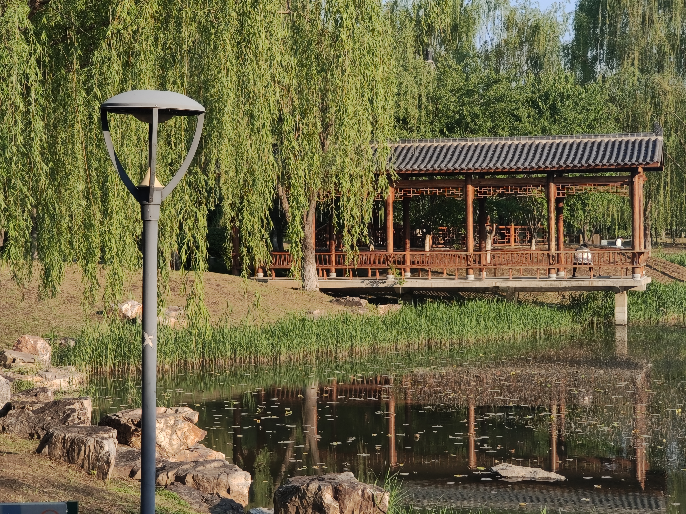
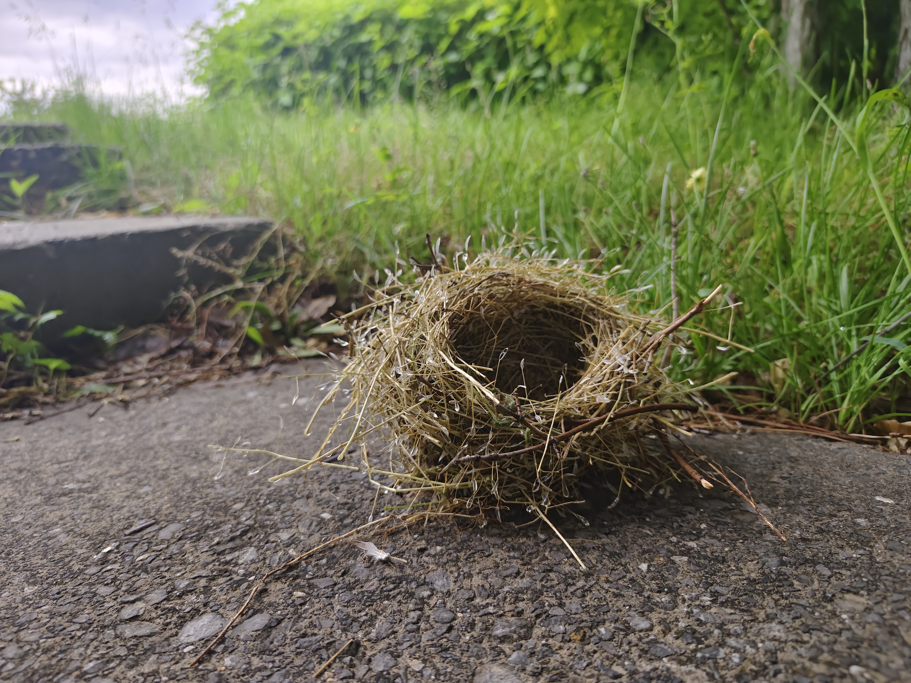
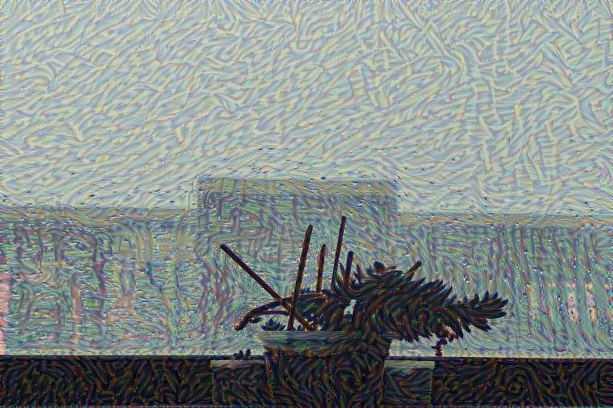
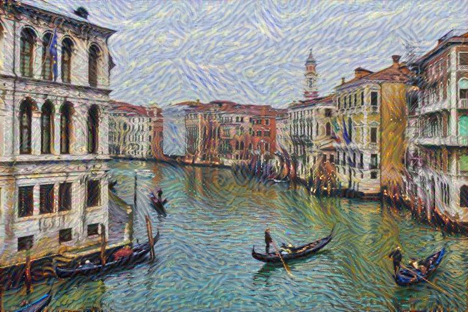

# 基于VGG19的图像风格迁移数据分析报告
**项目名称**：基于基于深度学习的图像内容与风格特征分析及迁移。
**核心技术**：卷积神经网络(VGG19)、内容/风格损失函数、Adam优化算法
**Github**：**https://github.com/guizxy/ML-project.git**
___
## 1. 项目概述
### 1.1 项目目的
本项目旨在利用机器学习方法，对图像数据进行深层次的特征分析与应用。具体而言，我们选择经典的“图像风格迁移”作为切入点，将一张图像的“内容”和另一张图像的“风格”进行融合，生成一幅全新的艺术作品。该实验要完成图像风格迁移。图像风格迁移根据给定的目标风格图像和目标内容图像求解风格迁移图像，使风格迁移图像在风格上与目标风格图像一致，在内容上与目标内容图像一致。
### 1.2 背景简介
项目遵循“数据-方法-分析-验证”的完整流程。我们不仅调用了成熟的VGG19模型，更是从底层使用`numpy`库手动实现了模型中的关键计算层、损失函数和优化器。此外，项目还对核心的卷积运算进行了性能优化，并进行了量化验证。这不仅是一个关于算法应用的项目，更是一次对深度学习模型**工作原理**和**系统性能优化**的深度探索。
图像风格迁移通过**目标风格图像**和**风格损失函数**提取图像风格的特征；然后通过**目标内容图像**和**内容损失函数**提取图像内容的特征。然后两者的内容特征进入卷积神经网络中在一个噪声图上“作画”。
图像风格迁移根据给定的目标风格图像和目标内容图像求解**风格迁移图像**，使风格迁移图像在**风格**上与目标风格图像一致，在**内容**上与目标内容图像一致。图像风格迁移分为**非实时**风格迁移与**实时**风格迁移。非实时风格迁移仅对当前给定的目标内容图像进行风格化，实现较为简单，不需要训练模型，但对不同的内容图像需要重新执行整个训练过程。实时风格迁移训练一个模型进行风格化，实现相对复杂，但模型训练完成后对任意内容图像做推断即可生成风格化图像，不需要重新训练模型。  
风格迁移通常使用VGG模型(如VGG19)提取图像的特征，用于计算风格迁移图像与目标风格(内容)图像的风格(内容)损失。完整的**非实时风格迁移**过程见下图。每次迭代时，在前向传播计算过程中利用VGG19提取图像特征，并计算风格(内容)损失函数，然后进行反向传播，获得风格迁移图像的梯度，最后更新风格迁移图像。通过多次迭代，不断减小风格迁移图像与目标风格(内容)图像的风格(内容)损失，最终获得风格化的图像。在非实时风格迁移中，通常用加入噪声的目标内容图像作为初始的风格迁移图像。

## 2. 数据层面
### 2.1 输入
本项目使用的数据模态为图像，具体包含三类：
1. **内容图像(Content Image)**：提供绘画主题的源图像。本项目中，我们使用了多张照片。
- 暴雨的阴沉

- 小南湖公园

- 公园里掉到地上的鸟窝

- 威尼斯水城

2. **风格图像(Style Image)**：提供艺术风格（如色彩、笔触）的源图像。本项目中，我们使用梵高的名作《星空》。

3. **生成图像(Generated Image)**：初始为一张带噪声的随机图像，在训练过程中不断迭代优化，最终成为我们的目标作品。
### 2.2 预处理
数据预处理流程：
为了使数据能被VGG19网络**正确**处理，我们对输入图像进行了以下**标准化**步骤：
1. **尺寸归一化**：将内容图像和风格图像统一缩放到相同尺寸，以便于网络层特征图的尺寸对齐。
2. **数据类型转换**：将图像像素值转换为float32类型。
3. **中心化**：减去ImageNet数据集的RGB均值，这是VGG19预训练模型要求的标准操作，可以加速模型收敛。
4. **维度重排**：将图像数据从 [H, W, C] (高, 宽, 通道) 的格式转换为 [N, C, H, W] (数量, 通道, 高, 宽) 的格式，以符合我们实现的网络层的输入要求。
## 3. 方法层面
本项目的核心方法是基于Gatys等人的论文《A Neural Algorithm of Artistic Style》所提出的框架。其精髓在于：利用一个预训练好的深度卷积神经网络（VGG19）作为特征提取器，分别定义和度量“内容”与“风格”，并将其作为损失函数来指导一张新图像的生成。
### 3.1 模型
我们使用在**ImageNet**上预训练好的VGG19网络。该网络的深层结构使其能够学习到从低级（如边缘、颜色）到高级（如物体轮廓）的丰富图像特征。我们并不对VGG19的权重进行训练，而是仅用其进行前向传播，提取特定中间层的**激活图**作为图像的特征表示。

- **内容特征**：我们发现，网络较深的卷积层（如`relu4_2`）保留了更多关于图像宏观布局和物体结构的信息，适合作为内容特征。
- **风格特征**：网络中从浅到深的多层（如`relu1_1`, `relu2_1`, `relu3_1`, `relu4_1`, `relu5_1`）的特征图组合起来，可以更好地捕捉图像的整体风格。这些层的特征图包含了颜色、纹理、笔触等不同尺度的风格信息。
### 3.2 算法
相比于图像分类，风格迁移添加了内容损失和风格损失去实现风格的迁移。所以主要介绍的是**内容/风格损失层**的前向传播和反向传播，还有经过优化之后的**卷积层**和**池化层**的前向传播和反向传播。
#### 3.2.1 内容损失层(Content Loss)
1. 前向传播
内容损失用于衡量“生成图像”和“内容图像”在内容上的相似度。我们将其定义为两者在VGG19特定层（`relu4_2`）输出的特征图之间的均方误差(MSE)。
$$L_{content}=\frac1{2NCHW}\sum_{n,c,h,w}(X^l(n,c,h,w)-Y^l(n,c,h,w))^2$$
其中：
- $X^l$：**生成**图像在$l$层的特征图。
- $Y^l$：**内容**图像在$l$层的特征图。
- 该损失函数会驱使生成图像保留内容图像的物体轮廓和空间结构。

内容损失层**前向**传播代码
```python
    def forward(self, input_layer, content_layer):  # 内容损失层前向传播
        # L = ∑(input - content)^2 / (2 * NCHW)
        loss = (np.sum(input_layer.reshape(-1) - content_layer.reshape(-1))
                ** 2) * 0.5 / content_layer.size
        return loss
```
2. 反向传播
反向传播公式
$$\nabla_{X^{l}(n,i,h,w)} L^{l}_{\text{style}}=\frac{1}{NC^2H^2W^2}\sum_j X^{l}(n,j,h,w)\left( G^{l}(n,j,i) - A^{l}(n,j,i)\right)$$

内容损失层**反向**传播代码
```python
    def backward(self, input_layer, content_layer):  # 内容损失层反向传播
        # ▽L = (input - content) / NCHW
        bottom_diff = (input_layer - content_layer) / content_layer.size
        return bottom_diff
```
#### 3.2.2 风格损失层(Style Loss)
1. 前向传播
风格损失的度量更为巧妙。它不直接比较特征图，而是比较特征图的相关性。我们通过计算“格拉姆矩阵”(Gram Matrix)来捕捉风格信息。格拉姆矩阵计算了同一层中不同特征图之间的内积，反映了哪些特征倾向于同时出现。

**Gram矩阵**计算公式
$$G^l(n,i,j) = \sum_{h,w} X^l(n,i,h,w) X^l(n,j,h,w)$$
$$A^l(n,i,j) = \sum_{h,w} Y^l(n,i,h,w) Y^l(n,j,h,w)$$
损失函数计算公式
$$L^l_{style}=\frac1{4NC^2H^2W^2}\sum_{n,i,j}(G^l(n,i,j)-A^l(n,i,j))^2$$
其中：
- $G^l(n,i,j)$：**生成**图像的格拉姆矩阵。
- $A^l(n,i,j)$：**风格**图像的格拉姆矩阵。
- 该损失函数会驱使生成图像学习到风格图像的色彩分布、纹理和笔触模式。

风格损失层**前向**传播代码
```python
    def forward(self, input_layer, style_layer):  # 风格损失层前向传播(计算Gram矩阵)
        # 计算A--gram_style
        # style_layer[N,C,H,W] -> style_layer_reshape[N,C,H * W]
        style_layer_reshape = np.reshape(
            style_layer, [style_layer.shape[0], style_layer.shape[1], -1])
        # A(n,i,j) = ∑ Y(n,i,h,w)Y(n,j,h,w) 目标风格图像的风格特征A
        self.gram_style = np.array([np.matmul(
            style_layer_reshape[n, :, :], style_layer_reshape[n, :, :].T) for n in range(style_layer.shape[0])])
        # 计算G--gram_input
        # input_layer[N,C,H,W] -> input_layer_reshape[N,C,H * W]
        self.input_layer_reshape = np.reshape(
            input_layer, [input_layer.shape[0], input_layer.shape[1], -1])
        # G(n,i,j) = ∑ X(n,i,h,w)X(n,j,h,w) 风格迁移图像的风格特征G
        self.gram_input = np.array([np.matmul(
            self.input_layer_reshape[n, :, :], self.input_layer_reshape[n, :, :].T) for n in range(input_layer.shape[0])])
        # 计算第I层风格损失
        M = input_layer.shape[2] * input_layer.shape[3]  # W * H
        N = input_layer.shape[1]  # C
        self.div = M * M * N * N  # W^2 * H^2 * C ^ 2
        # G - A
        style_diff = self.gram_input - self.gram_style
        # (∑(G - A)^2) / (4 * N * C^2 * H^2 * W^2)
        loss = np.sum(style_diff**2) / (self.div * style_layer.shape[0] * 4.0)
        return loss
```
2. 反向传播
反向传播公式
$$\nabla_{X^{l}(n,c,h,w)} L_{\text{content}}=\frac{1}{NCHW} (X^{l}(n,c,h,w) - Y^{l}(n,c,h,w))$$

风格损失函数**反向**传播代码
```python
    def backward(self, input_layer, style_layer):  # 风格损失层反向传播
        # ->bottom_diff(N,C,H*W)
        bottom_diff = np.zeros(
            [input_layer.shape[0], input_layer.shape[1], input_layer.shape[2]*input_layer.shape[3]])
        for n in range(input_layer.shape[0]):
            # ▽L = (∑X(G-A)) / (N * C^2 * H^2 * W^2)
            bottom_diff[n, :, :] = np.matmul(
                (self.gram_input[n, :, :] - self.gram_style[n, :, :]).T, self.input_layer_reshape[n, :, :]) / (self.div * style_layer.shape[0])
        bottom_diff = np.reshape(bottom_diff, input_layer.shape)
        return bottom_diff
```
#### 3.2.3 卷积层(Convolution)
在卷积计算中，写了两种前向传播和反向传播的函数。一种是直接进行运算，另一种是通过im2col(image to column)优化。其基本原理就是将原本需要用多层循环实现的卷积操作，巧妙地转换成一次单一的、但规模宏大的**矩阵乘法**，以此利用**现代计算库**对矩阵运算的极致优化来大幅提升计算速度。
##### 前向传播优化
优化前的卷积层**前向**传播代码
```python
    def forward_raw(self, input):  # 优化前的前向传播
        self.input = input  # [N, C, H, W]
        height = self.input.shape[2] + self.padding * 2
        width = self.input.shape[3] + self.padding * 2
        self.input_pad = np.zeros(
            [self.input.shape[0], self.input.shape[1], height, width])
        self.input_pad[:, :, self.padding:self.input.shape[2] + self.padding,
                       self.padding:self.input.shape[3] + self.padding] = self.input
        height_out = (height - self.kernel_size) // self.stride + 1
        width_out = (width - self.kernel_size) // self.stride + 1
        self.output = np.zeros(
            [self.input.shape[0], self.channel_out, height_out, width_out])
        for idxn in range(self.input.shape[0]):
            for idxc in range(self.channel_out):
                for idxh in range(height_out):
                    for idxw in range(width_out):
                        self.output[idxn, idxc, idxh, idxw] = np.sum(self.input_pad[idxn, :, idxh * self.stride: idxh * self.stride + self.kernel_size,
                                                                     idxw * self.stride: idxw * self.stride + self.kernel_size] * self.weight[:, :, :, idxc]) + self.bias[idxc]
        return self.output
```
这个函数以最直观的方式实现了卷积的定义，即“滑动窗口”式的点积运算。
- **填充 (Padding)**: 首先，在输入特征图的周围填充一圈0，以确保卷积核在处理边缘像素时不会超出边界。
- **循环迭代**: 代码使用了四层嵌套的`for`循环，目的是遍历输出特征图上的每一个像素点，并计算出它的值。
- **计算点积**: 在循环的最内层，对于输出图上的每一个点，程序会：
    - 从填充后的输入图中，切分出一个与卷积核大小完全相同的区域（即“感受野”）。 
    - 将这个区域与对应的卷积核（权重）进行逐元素的乘法，然后将所有乘积相加（即点积运算），最后再加上偏置项（bias）。
    - 这个最终计算出的单个数值，就是输出特征图上对应位置的像素值。

这个方法虽然逻辑清晰，易于理解，但由于大量使用Python的`for`循环，其计算效率非常低下。

优化后的卷积层**前向**传播代码
```python
    def forward_speedup(self, input):  # 优化后的前向传播
        self.input = input  # [N, C, H, W]
        height = self.input.shape[2] + self.padding * 2
        width = self.input.shape[3] + self.padding * 2
        self.input_pad = np.zeros(
            [self.input.shape[0], self.input.shape[1], height, width])
        self.input_pad[:, :, self.padding:self.padding+self.input.shape[2],
                       self.padding:self.padding+self.input.shape[3]] = self.input
        height_out = (height - self.kernel_size) // self.stride + 1
        width_out = (width - self.kernel_size) // self.stride + 1
        # input_col[N,H*W,C*K*K]
        self.input_col = np.zeros(
            [self.input.shape[0], height_out*width_out, self.input.shape[1]*(self.kernel_size**2)])
        for i in range(height_out):
            for j in range(width_out):
                self.input_col[:, i*width_out+j, :] = self.input_pad[:, :, i*self.stride:i*self.stride +
                                                                     self.kernel_size, j*self.stride:j*self.stride+self.kernel_size].reshape(self.input.shape[0], -1)
        # weight_col[C*K*K,Cout]
        weight_col = self.weight.reshape(-1, self.channel_out)
        # output_col[N*H*W,Cout]
        self.output_col = np.matmul(
            self.input_col.reshape(-1, self.input_col.shape[-1]), weight_col)
        # 恢复形状
        self.output = (self.output_col.reshape(
            self.input.shape[0], height_out, width_out, self.channel_out) + self.bias).transpose(0, 3, 1, 2)
        return self.output
```
这个函数运用了 **im2col** 方法，其结果与 `forward_raw` 完全相同，但计算速度快得多。
- **输入转换 (im2col)**: 这是优化的关键。程序不再是滑动窗口，而是一次性地将所有可能被卷积核覆盖到的感受野区域全部提取出来。每个感受野区域都被拉伸成一个长长的列向量，然后将这些列向量并排堆叠，形成一个巨大的二维矩阵 `self.input_col`。
    - 在这个新矩阵中，**每一行**都代表了一个输出点所对应的**感受野**。
- **权重转换**: 同样地，原来四维的卷积核（权重）张量也被重新排列成一个二维矩阵 `weight_col`。
    - 在这个新矩阵中，**每一列**都代表一个被拉伸成一维的**卷积核**。
- **矩阵乘法**: 经过上述两次转换后，整个卷积运算现在变成了**一次性**的矩阵乘法。
    ```python
    # 整个卷积操作等价于一次矩阵乘法
    output_col = np.matmul(self.input_col, weight_col)
    ```
    这次乘法的结果 `output_col` 是一个二维矩阵，包含了所有输出点的计算结果，只是它们目前是“平铺”的。
- **恢复形状**: 最后，程序将这个平铺的二维结果矩阵重新“折叠”成标准四维 `(N, C, H, W)` 的输出特征图形状，并加上偏置项。

**优化原理:** 优化的本质在于用**一次高度优化的矩阵运算**代替了**数百万次独立的循环点积运算**。
- **硬件加速**: 像NumPy这样的科学计算库，其矩阵乘法（`matmul`）功能是由底层经过高度优化的C或Fortran语言（如BLAS库）实现的。这些库能够充分利用CPU的多核心并行计算能力和SIMD（单指令多数据流）等现代处理器特性，速度极快。
- **避免Python开销**: 相比之下，Python解释器执行`for`循环的开销非常大。通过将计算任务打包成一个大的矩阵乘法，可以最大限度地减少Python解释器的介入，让底层优化库完成大部分工作。

简单来说，**im2col** 方法是一种“空间换时间”的策略：它通过创建一个额外的大矩阵（消耗更多内存），来换取计算时间上的巨大优势。
##### 反向传播优化
优化前卷积层**反向**传播代码
```python
    def backward_raw(self, top_diff):  # 优化前的反向传播
        self.d_weight = np.zeros(self.weight.shape)
        self.d_bias = np.zeros(self.bias.shape)
        bottom_diff = np.zeros(self.input_pad.shape)
        for idxn in range(top_diff.shape[0]):
            for idxc in range(top_diff.shape[1]):
                for idxh in range(top_diff.shape[2]):
                    for idxw in range(top_diff.shape[3]):
                        # W = W - η*(∂L/∂W), ∂L/∂W = xT * (∂L/∂z), ∂L/∂z = top_diff
                        self.d_weight[:, :, :, idxc] += top_diff[idxn, idxc, idxh, idxw] * self.input_pad[idxn, :, idxh *
                                                                                                          self.stride:idxh*self.stride+self.kernel_size, idxw*self.stride:idxw*self.stride+self.kernel_size]  # [N,H,W,C]
                        self.d_bias[idxc] += top_diff[idxn, idxc, idxh, idxw]
                        bottom_diff[idxn, :, idxh*self.stride:idxh*self.stride+self.kernel_size, idxw*self.stride:idxw *
                                    self.stride+self.kernel_size] += top_diff[idxn, idxc, idxh, idxw] * self.weight[:, :, :, idxc]
        bottom_diff = bottom_diff[:, :, self.padding:self.padding +
                                  self.input.shape[2], self.padding:self.padding+self.input.shape[3]]
        return bottom_diff
```
这个函数通过四层嵌套`for`循环，遍历上层传来的梯度`top_diff`的每一个元素，然后用这个梯度值去更新上述三个梯度的相应部分。
- **初始化**: 先创建三个全为零的梯度张量：`self.d_weight`, `self.d_bias`, `bottom_diff`。
- **循环与累加**:
    - `for`循环遍历`top_diff`的每个维度（批次、输出通道、高、宽）。
    - 在循环的最内层，针对`top_diff`中的**一个**梯度值，代码会同时做三件事：
        - **更新 `d_weight`**: 权重梯度等于“产生该输出的输入区域”与“该输出的梯度值”的乘积。代码通过累加的方式 `self.d_weight[:, :, :, idxc] += ...` 将这些乘积加到总的权重梯度上。
        - **更新 `d_bias`**: 偏置梯度等于该通道上所有梯度值的总和。代码通过 `self.d_bias[idxc] += ...` 将梯度值累加到对应的偏置梯度上。
        - **更新 `bottom_diff`**: 输入梯度等于“该输出的梯度值”与“对应的卷积核”的乘积，“散布”回梯度的来源区域。代码通过 `bottom_diff[...] += ...` 将这个乘积累加到输入梯度张量的对应位置上。
- **返回**: 最后返回裁剪掉填充区域的 `bottom_diff`。

这个方法非常直观，但效率极低，因为它完全依赖于缓慢的Python循环进行计算和累加。

优化后的卷积层**反向**传播代码
```python
    def backward_speedup(self, top_diff):  # 优化后的反向传播
        top_diff_reshaped = top_diff.transpose(
            0, 2, 3, 1).reshape(-1, self.channel_out)
        input_col_reshaped = self.input_col.reshape(
            -1, self.input_col.shape[-1])
        d_weight_col = np.matmul(input_col_reshaped.T, top_diff_reshaped)
        self.d_weight = d_weight_col.reshape(self.weight.shape)
        self.d_bias = np.sum(top_diff, axis=(0, 2, 3))
        bottom_diff = np.zeros(self.input_pad.shape)
        top_diff_pad = np.zeros([top_diff.shape[0], top_diff.shape[1], top_diff.shape[2] +
                                 2*self.kernel_size-2, top_diff.shape[3]+2*self.kernel_size-2])
        top_diff_pad[:, :, self.kernel_size-1:1-self.kernel_size,
                     self.kernel_size-1:1-self.kernel_size] = top_diff
        # top_diff_pad_col[N,H*W,C*K*K]
        top_diff_pad_col = np.zeros([self.input.shape[0], self.input_pad.shape[2]
                                     * self.input_pad.shape[3], top_diff.shape[1]*(self.kernel_size**2)])
        for i in range(self.input_pad.shape[2]):
            for j in range(self.input_pad.shape[3]):
                top_diff_pad_col[:, i*self.input_pad.shape[3]+j, :] = top_diff_pad[:, :, i*self.stride:i*self.stride +
                                                                                   self.kernel_size, j*self.stride:j*self.stride+self.kernel_size].reshape(self.input.shape[0], -1)
        weight_col = np.rot90(self.weight, k=2, axes=(1, 2)).transpose(
            3, 1, 2, 0).reshape(-1, self.channel_in)
        bottom_diff_col = np.matmul(
            top_diff_pad_col.reshape(-1, top_diff_pad_col.shape[-1]), weight_col)
        bottom_diff = bottom_diff_col.reshape(
            self.input.shape[0], self.input_pad.shape[2], self.input_pad.shape[3], self.channel_in).transpose(0, 3, 1, 2)
        bottom_diff = bottom_diff[:, :, self.padding:self.padding +
                                  self.input.shape[2], self.padding:self.padding+self.input.shape[3]]
        return bottom_diff
```
这个函数的目标是用矩阵运算代替循环。
- **计算偏置梯度 (`d_bias`)**:
    - **优化**: `self.d_bias = np.sum(top_diff, axis=(0, 2, 3))`
    - **解释**: 这行代码用一次`np.sum`调用代替了整个循环。它沿着批次(0)、高度(2)和宽度(3)维度对`top_diff`求和，直接得到了每个输出通道的梯度总和，高效且简洁。
- **计算权重梯度 (`d_weight`) - (理论上的优化)**:
    - **优化**: 将权重梯度的累加过程转换成一次矩阵乘法。
    - **解释**: 权重梯度的计算公式可以变形为 `(input_col)^T @ (reshaped_top_diff)`。这需要将在前向传播中生成的`input_col`矩阵，与一个经过`im2col`方法变形后的`top_diff`矩阵相乘。这样，原本在`for`循环中成千上万次的累加操作，就变成了一次高效的矩阵乘法。
- **计算输入梯度 (`bottom_diff`)**:
    - **优化**: 计算输入梯度在数学上等价于一次特殊的卷积（卷积核旋转180度）。这个过程同样可以通过`im2col`的思想转为矩阵乘法。
    - **解释**:
        - `weight_col = np.rot90(self.weight, k=2, axes=(1, 2))...`: 首先将卷积核旋转180度，并将其“拉平”成一个二维矩阵。  
        - `top_diff_pad_col = ...`: 对上层传来的梯度`top_diff`执行类似`im2col`的转换，也得到一个二维矩阵。
        - `bottom_diff_col = np.matmul(...)`: 通过一次矩阵乘法，计算出“平铺”状态的输入梯度。
        - 最后，将结果“折叠”恢复成标准四维形状，得到最终的`bottom_diff`。

无论是计算哪个梯度，优化的核心原理都是相同的：**避免使用Python循环，将计算任务（无论是累加还是卷积）重新组织成可以调用底层优化库（如BLAS）的大规模矩阵乘法**。这是一种典型的用向量化思想提升计算密集型任务性能的策略。
#### 3.2.4 最大池化层(Max Pooling)
优化的核心思想始终是**用高效的、向量化的NumPy数组操作，代替缓慢的、逐元素的Python `for`循环**。
##### 前向传播
优化前的版本使用四层嵌套`for`循环，逐一处理输出图上的每个像素点，效率极低。

优化前最大池化层**前向**传播代码
```python
    def forward_raw(self, input):  # 优化前的前向传播
        self.input = input  # [N, C, H, W]
        self.max_index = np.zeros(self.input.shape)
        height_out = (self.input.shape[2] -
                      self.kernel_size) // self.stride + 1
        width_out = (self.input.shape[3] - self.kernel_size) // self.stride + 1
        self.output = np.zeros(
            [self.input.shape[0], self.input.shape[1], height_out, width_out])
        for idxn in range(self.input.shape[0]):
            for idxc in range(self.input.shape[1]):
                for idxh in range(height_out):
                    for idxw in range(width_out):
                        self.output[idxn, idxc, idxh, idxw] = np.max(
                            self.input[idxn, idxc, idxh * self.stride: idxh * self.stride + self.kernel_size, idxw * self.stride: idxw * self.stride + self.kernel_size])
                        curren_max_index = np.argmax(
                            self.input[idxn, idxc, idxh*self.stride:idxh*self.stride+self.kernel_size, idxw*self.stride:idxw*self.stride+self.kernel_size])
                        curren_max_index = np.unravel_index(
                            curren_max_index, [self.kernel_size, self.kernel_size])
                        self.max_index[idxn, idxc, idxh*self.stride +
                                       curren_max_index[0], idxw*self.stride+curren_max_index[1]] = 1
        return self.output
```

优化后的前向传播借鉴了`im2col`的思想，将输入数据重排，以便一次性完成所有池化窗口的计算。

优化后最大池化层**前向**传播代码
```python
    def forward_speedup(self, input):  # 优化后的前向传播
        self.input = input
        height_out = (self.input.shape[2] -
                      self.kernel_size) // self.stride + 1
        width_out = (self.input.shape[3] - self.kernel_size) // self.stride + 1
        self.output = np.zeros(
            [self.input.shape[0], self.input.shape[1], height_out, width_out])
        self.input_col = np.zeros(
            [self.input.shape[0], self.input.shape[1], height_out*width_out, self.kernel_size**2])
        for i in range(height_out):
            for j in range(width_out):
                self.input_col[:, :, i*width_out+j, :] = self.input[:, :, i*self.stride:i*self.stride+self.kernel_size,
                                                                    j*self.stride:j*self.stride+self.kernel_size].reshape(self.input.shape[0], self.input.shape[1], -1)
        self.output_col = np.max(self.input_col, axis=3)
        max_index_col = np.zeros(
            [self.input.shape[0]*self.input.shape[1]*height_out*width_out, self.kernel_size**2])
        max_index_col[np.arange(self.input.shape[0]*self.input.shape[1]*height_out *
                                width_out), np.argmax(self.input_col, axis=3).reshape(-1)] = 1
        max_index_col = max_index_col.reshape(
            [self.input.shape[0], self.input.shape[1], height_out*width_out, self.kernel_size**2])
        self.output = self.output_col.reshape(
            [self.input.shape[0], self.input.shape[1], height_out, width_out])
        self.max_index = np.zeros(self.input.shape)
        for i in range(height_out):
            for j in range(width_out):
                self.max_index[:, :, i*self.stride:i*self.stride+self.kernel_size, j*self.stride:j*self.stride+self.kernel_size] = max_index_col[:,
                                                                                                                                                 :, i*width_out+j, :].reshape([self.input.shape[0], self.input.shape[1], self.kernel_size, self.kernel_size])
        return self.output
```
- **输入转换**:
    - 代码首先创建一个新的四维张量`self.input_col`。
    - 它通过循环将输入`self.input`中的每一个池化窗口（例如2x2的区域）“拉平”成一个向量，并存入`self.input_col`的一个新维度中。
    - 这个操作完成后，`self.input_col`的结构可以理解为将所有池化窗口并列排好，方便进行并行计算。
- **向量化计算**:
    - **计算最大值**: 代码不再使用循环，而是直接调用`self.output_col = np.max(self.input_col, axis=3)`。这一步利用了NumPy的向量化能力，沿着刚才创建的新维度（`axis=3`）一次性地找出了所有窗口的最大值，这是加速的关键。
    - **记录索引**: 类似地，它使用`np.argmax(self.input_col, axis=3)`一次性地找到了所有最大值在各自窗口内的索引。
- **恢复与重建**:
    - 将计算出的最大值`self.output_col`恢复成标准输出的形状。
    - 根据记录的索引，重建用于反向传播的`self.max_index`掩码矩阵。

**优化原理**: 通过将输入重排，把原本需要上万次循环才能完成的“取最大值”操作，变成了一次NumPy的`np.max`调用。NumPy底层由C语言实现，可以充分利用CPU的并行计算能力，因此效率远高于Python循环。
##### 反向传播
优化前的版本同样使用`for`循环，遍历上层传来的梯度`top_diff`，然后找到对应窗口的最大值位置，再将梯度值“放”回去，过程繁琐且缓慢。

优化前最大池化层**反向**传播代码
```python
    def backward_raw(self, top_diff):  # 优化前的反向传播
        bottom_diff = np.zeros(self.input.shape)
        for idxn in range(top_diff.shape[0]):
            for idxc in range(top_diff.shape[1]):
                for idxh in range(top_diff.shape[2]):
                    for idxw in range(top_diff.shape[3]):
                        max_index = np.argmax(self.input[idxn, idxc, idxh*self.stride:idxh*self.stride +
                                              self.kernel_size, idxw*self.stride:idxw*self.stride+self.kernel_size])
                        max_index = np.unravel_index(
                            max_index, [self.kernel_size, self.kernel_size])
                        bottom_diff[idxn, idxc, idxh*self.stride+max_index[0], idxw *
                                    self.stride+max_index[1]] = top_diff[idxn, idxc, idxh, idxw]
        return bottom_diff
```
优化后的反向传播非常巧妙，它完全避免了循环，仅通过两次数组操作就完成了梯度的“路由”。

优化后最大池化层反向传播代码
```python
    def backward_speedup(self, top_diff):  # 优化后的反向传播
        bottom_diff = np.multiply(self.max_index, top_diff.repeat(
            self.kernel_size, 2).repeat(self.kernel_size, 3))
        return bottom_diff
```
- **梯度“放大” (Gradient "Upsampling")**:
    - `top_diff.repeat(self.kernel_size, 2).repeat(self.kernel_size, 3)` 
    - 这一步是关键。它将上层传来的、尺寸较小的梯度图`top_diff`进行放大。例如，对于一个2x2的池化，它会将`top_diff`中的每个梯度值复制成一个2x2的块，从而生成一个与池化层输入尺寸相同的新梯度图。在这个新图中，原本一个池化窗口对应区域内的所有像素，都暂时拥有了相同的梯度值。
- **应用掩码 (Applying the Mask)**:
    - `np.multiply(self.max_index, ...)`
    - `self.max_index`是在前向传播时记录下的“最大值位置掩码”（最大值位置为1，其余为0）。
    - 将这个掩码与上一步放大后的梯度图进行**逐元素相乘**。
    - 结果是：只有在“最大值”位置上的梯度被保留了下来，而同一窗口内其他位置的梯度因为乘以0而全部清零。

**优化原理**: 这个方法将复杂的梯度“路由”问题，转换成了一个“广播/放大”和“掩码”问题。它利用NumPy的`repeat`和`multiply`等高效的向量化操作，代替了所有`for`循环和条件判断，代码更简洁，执行效率也大大提高。
### 3.3 优化过程
总损失函数是内容损失和风格损失的加权和：
$$L_{total} = \alpha L_{content} + \beta L_{style}$$
其中
- $\alpha$和$\beta$是超参数，用于平衡内容保留和风格迁移的程度。我们的目标不是训练网络权重，而是**直接优化生成图像的像素值**。
1. 以一张随机噪声图作为初始的生成图像。
2. 将其输入VGG19网络，计算总损失 L_total。
3. 通过反向传播计算总损失对生成图像每个像素的梯度。
4. 使用我们手动实现的**Adam优化器**，根据梯度更新图像的像素值。
5. 重复以上步骤，直到损失收敛或达到预设的迭代次数。

**Adma优化器**
Adam(Adaptive Moment Estimation)是一种非常流行和高效的优化算法，尤其适用于深度学习。它的核心思想是**结合了另外两种优化算法的优点：Momentum（动量）和 RMSprop**。
- **动量 (Momentum) - 梯度的一阶矩估计**:
    - **思想**: 想象一个球从山上滚下来，它不仅受当前斜坡（当前梯度）的影响，还带有之前的速度（惯性）。Momentum方法就是模拟这个过程，它计算梯度的**指数移动平均值**，并使用这个平均值来更新参数。
    - **优点**: 这有助于加速球在正确方向上的滚动，并抑制在“沟壑”中的震荡，让收敛过程更快更稳定。
    - **在代码中**: `self.mt` 就是这个动量项（一阶矩），`self.beta1` 是控制其“遗忘”速度的超参数。
- **RMSprop - 梯度的二阶矩估计**:
    - **思想**: 不同的参数可能需要不同的学习率。对于梯度一直很大的参数，我们可能希望学习率小一点以免“冲过头”；对于梯度很小的参数，我们希望学习率大一点以加速学习。RMSprop通过计算梯度**平方**的指数移动平均值来实现这一点。
    - **优点**: 它为每个参数提供了自适应的学习率。
    - **在代码中**: `self.vt` 就是这个自适应学习率项（二阶矩），`self.beta2` 是其超参数。 
- **偏差修正 (Bias Correction)**:
    - **问题**: 由于 `mt` 和 `vt` 在开始时被初始化为0，在训练初期，它们的计算值会偏向于零。 
    - **修正**: Adam通过一个简单的公式对 `mt` 和 `vt` 进行修正，得到无偏估计 `mt_hat` 和 `vt_hat`。这使得优化器在训练初期也能有比较准确的梯度矩估计。
## 4. 分析层面
### 4.1 分析
#### 4.1.1 视觉效果分析
经过300次的迭代训练，最终生成的图像将梵高《星夜》的**卷曲**笔触、标志性的**蓝黄色调**与输入图像的结构轮廓融为一体，达到了**预期**的艺术效果。


#### 4.1.2 收敛性分析
在训练过程中，我们记录了总损失、内容损失和风格损失的变化。如下图所示，总损失随着迭代次数的增加而稳定下降。这表明我们的优化方向是正确的，模型有效地学习到了目标特征。
```json
Step 105, loss = 37199523012.183029 [1.73448932e+09] [8.65536818e+04 7.78319518e+06 1.33943784e+07 1.03864938e+08
 3.57764931e+05]
cost time: 245.503535
Save image at ./output/output_105.jpg
Step 110, loss = 36939102283.987350 [1.72791201e+09] [8.63136825e+04 7.70318471e+06 1.30150463e+07 9.78853164e+07
 3.53244448e+05]
cost time: 265.383205
Save image at ./output/output_110.jpg
Step 115, loss = 36642819064.708664 [1.71893948e+09] [8.60784113e+04 7.62358583e+06 1.26467584e+07 9.24962712e+07
 3.48777525e+05]
cost time: 261.750998
Save image at ./output/output_115.jpg
```
### 4.2 卷积层优化验证
我们通过`test_speedup`函数在主体任务开始之前，对卷积层前向传播和反向传播**优化效果**进行了定量验证。
- **正确性验证**：MSE值小于`0.003`，表明优化后的计算精度满足要求。
- **性能验证**：
    - **前向传播加速比 (Forward Speedup Ratio)**: `~204.515899x`
    - **反向传播加速比 (Backward Speedup Ratio)**: `~328.226952x`

结果输出：
```json
conv forward speedup time: 15.025616 ms
conv backward speedup time: 29.977798 ms
SPEEDUP CONV TEST PASS.
CONV FORWARD SPEEDUP RATIO: 204.515899
CONV BACKWARD SPEEDUP RATIO: 328.226952
```
实验结果有力地证明，通过将算法映射到更高效的计算原语(矩阵乘法)，我们可以在**不牺牲**精度的前提下，显著提升模型的运算速度。
## 5. 结论
本项目成功地基于VGG19网络，从底层完整实现了非实时图像风格迁移。整个过程覆盖了数据处理、模型构建、损失函数定义、梯度优化、结果分析和性能验证等多个环节。
项目的亮点在于：
1. **项目完整且深入**：不仅实现了上层应用，还深入到底层，手动编写了网络的核心组件，并附有详尽的公式与代码结合的解析，展现了对深度学习原理的深刻理解。
2. **兼顾效果与性能**：在实现算法功能的基础上，进一步探索了计算性能优化，并通过实验数据验证了优化的有效性。
通过本项目，我不仅掌握了图像风格迁移的技术细节，也对卷积神经网络如何提取和表示不同层级的图像特征有了**更直观**和**深入**的认识。